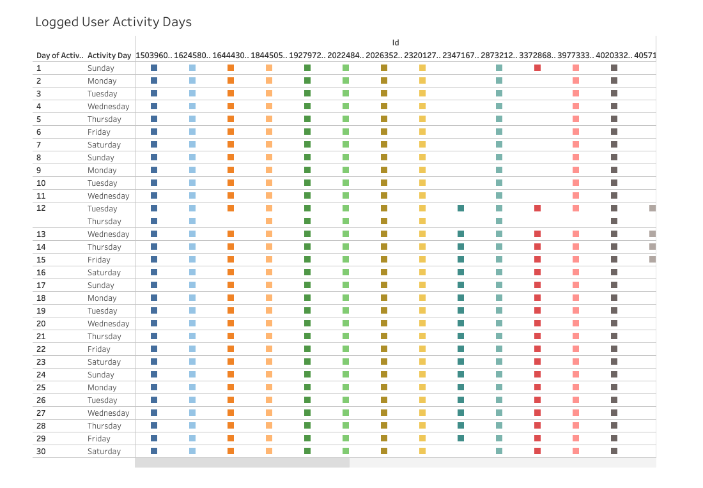

# Health App Analytics: A Case Study

*[Woman-Wearing-Pink-Collared-Half-Sleeved-Top](https://www.pexels.com/photo/woman-wearing-pink-collared-half-sleeved-top-1036623/) | [Pexels Licensed](https://www.pexels.com/license/)*

# Description
This is a capstone project for [Coursera's Google Data Analytics Professional Certificate](https://www.coursera.org/professional-certificates/google-data-analytics?) where I am analyzing [FitBit Fitness Tracker Data](https://www.kaggle.com/datasets/arashnic/fitbit) sourced from [Kaggle](https://www.kaggle.com/).

This project will follow Google's data analytics structured framework of "Ask, Prepare, Process, Analyze, Share, Act."

## Scenario
I am a junior data analyst working on the marketing analyst team at Bellabeat, a high-tech manufacturer of health-focused products for women. Bellabeat is a successful small company, but they have the potential to become a larger player in the global [smart device](https://en.wikipedia.org/wiki/Smart_device) market. Urška Sršen, Cofounder and Chief Creative Officer of Bellabeat, believes that analyzing smart device fitness data could help unlock new growth opportunities for the company. You have been asked to focus on one of Bellabeat’s products and analyze smart device data to gain insight into how consumers are using their smart devices. The insights you discover will then help guide marketing strategy for the company. You will present your analysis to the Bellabeat executive team along with your high-level recommendations for Bellabeat’s marketing strategy.

# **Ask**

1. What are some trends in smart device usage?
2. How could these trends apply to Bellabeat customers?
3. How could these trends help influence Bellabeat marketing strategy?

# **Prepare**

## **Storage**
The data has been warehoused in BigQuery. Some datasets could not immediately be loaded into BigQuery due to data type issues with the datetime columns. This was immediately resolved using R and the library `flipTime` to convert these columns into datetime format. Duplicates were checked and removed from all datasets. Only 2 minute_sleep and sleep_day contained duplicates. Nulls were only identified in the the Fat column of the weight_log_info dataset. These were not removed, since there is other valuable user data in the respective rows. Outliers were examined using boxplots, but no issues were identified. Following these steps, all data was loaded into BigQuery.

## **Organization**
The data is organized in long format which is ideal for performing advanced statistical analysis and graphing. Every dataset contains the Id variable, which serves as the primary key to link all datasets together.

## **Bias & Credibility - Reliable, Original, Comprehensive, Current, Cited (ROCCC)**
Using the ROCCC criteria below we can determine the bias and credibility of the dataset using a ‘high-medium-low-fail’ scale point system. Refer to the score key below. If the score is not perfect then any missing points must be communicated to all stakeholders to ensure concerns are appropriately addressed before proceeding. Depending on the context of the project an overall high score may not be required.

## **Data Integrity - Validating Licensing Security and Accessibility**

The integrity of the data was managed via SQL queries to validate the date ranges and distinct IDs declared in the Kaggle description. R analysis was conducted to validate any null or duplicate values. There are privacy concerns as noted in the table below.

# **Process**

| Tools   | Purpose                                        | 
|---------|------------------------------------------------|
| BigQuery| Data warehousing                               |   
| SQL     | Aggregation queries directly from BigQuery     |   
| R       | Data wrangling, analysis and visualizations    |  
| Tableau | Visualizations, dashboard and presentation     |   

## Data Cleaning Steps:

1. **Nulls** - weight_log_info is the only dataset with null values fo the Fat variable
2. **Duplicates** - minute_sleep (543 total) and sleep_day (3 total) datasets contained duplicate values and were inspected to ensure they were true duplicates. Duplicates were then removed
3. **Outliers** - R Boxplots were created to investigate whether problematic outliers existed. None were identified
4. **Common Variable Analysis** - SQL `SUM` queries were run on datasets which contained common variables to validate whether they returned the same outputs for consistency in data between datasets. No inconsistencies identified.

# **Analyze**

Below are some R and Tableau visualizations. The Tableau visualizations are screenshots from the presentation developed in Tableau, which has been linked with this repository. Key findings are noted in the slides below.

## Total Steps vs. Calories
Steps are positively correlated with calories burned.

## Total Minutes Asleep vs. Total Time in Bed
Very strong positive correlation between total minutes asleep and total time in bed.

## Steps vs. Calories per ID + Average Total Steps Per Day

## Activity Distribution + Total Activity Minutes per Day

# Average Total Intensity Over 24 Hours

# Logged User Activity Days
Most users login every day, but there are some who don't.

# Logged User Activity between Datasets

# **Share**

The data visualization software platform Tableau was used to generate the presentation and dashboards below.

## 1. [Presentation](https://public.tableau.com/app/profile/tyeson.demets/viz/HealthAppAnalyticsPresentation/Presentation#1) 
## 2. [Dashboard](https://public.tableau.com/app/profile/tyeson.demets/viz/HealthAppAnalyticsDashboard/Dashboard)

# **Act**

Overall, there are opportunities to increase user engagement. Over 4/5 of the time users are sedentary and only 1/5 of the time are they active. There are also opportunities to reduce friction with the lesser-used features in sleep, heartrate and weight monitoring. Plus there are opportunities to gamify the app to further enhance the level of play and fun the users can experience in using the health app. The slide below details my proposed recommendations for technical and marketing strategy recommendations.

 
